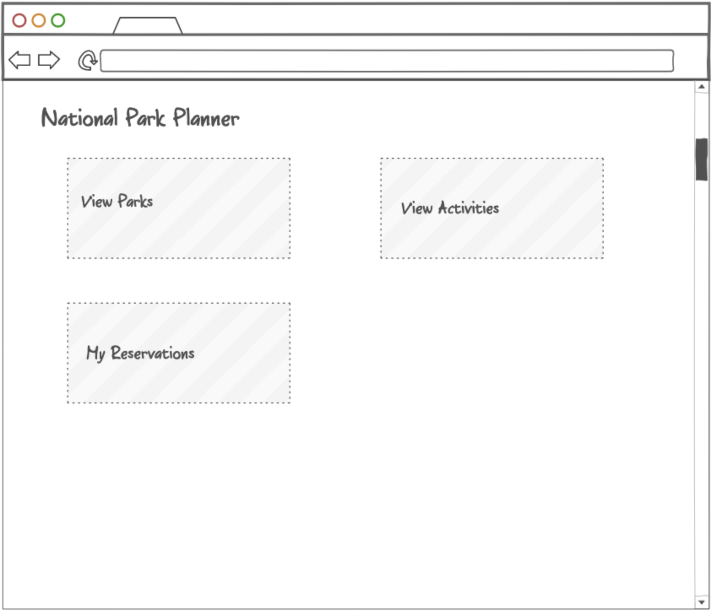
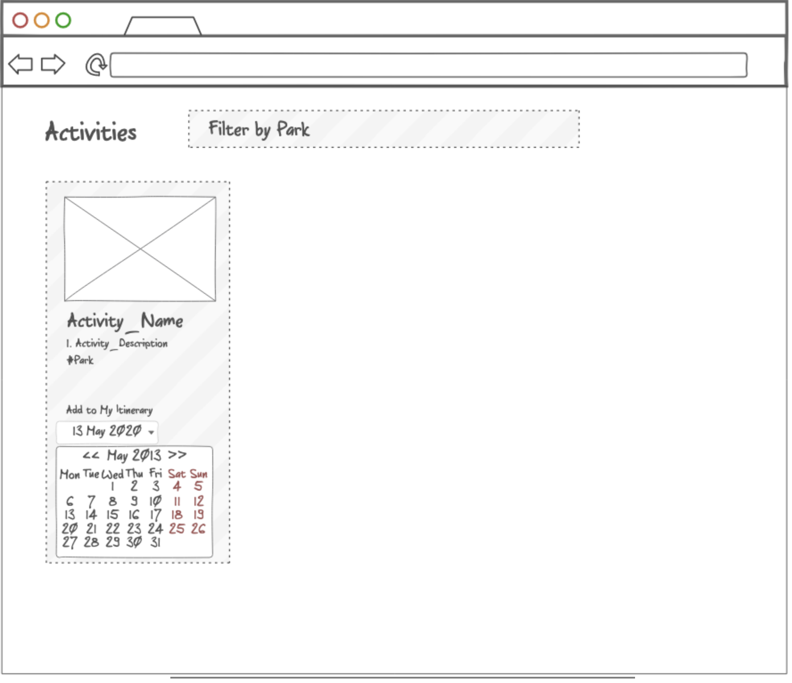
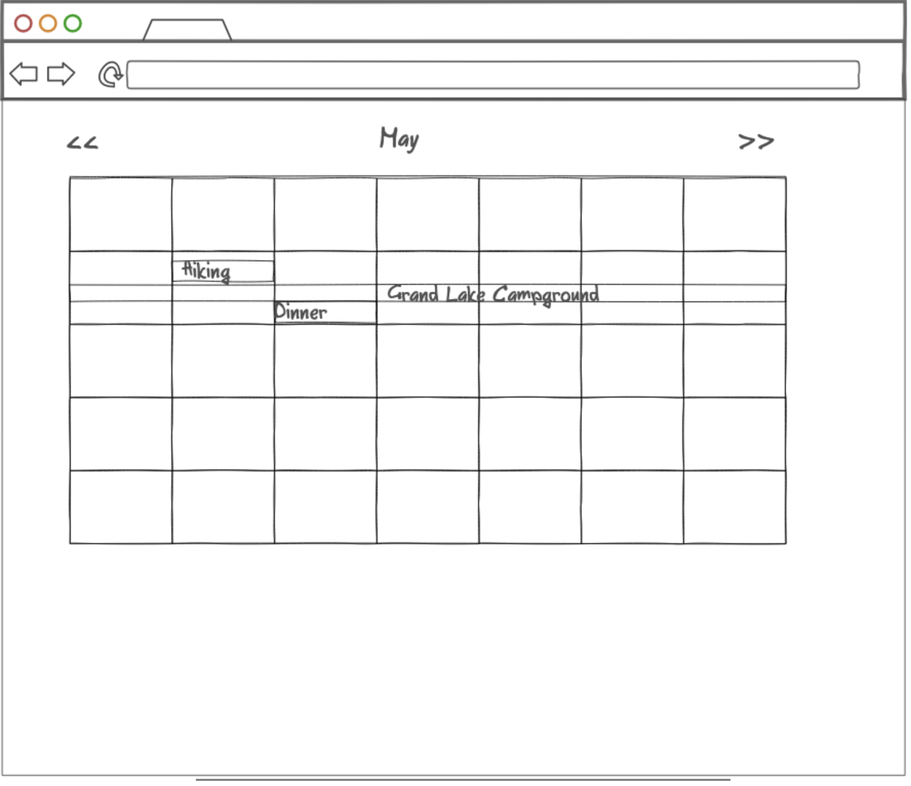

# National Park Planner

The National Park Planner allows you to browse a list of National Parks and plan your trip. The app will include lodging, activities, and dining options. There will be a calendar feature to which you can add your trip details, and a summary of trip selections. The purpose of this app is to encourage users to get outside and explore the beauty of the National Park Service. 

The backend repo can be found at https://github.com/ashfollen/backend-national-park-planner. 


## User Stories

* As a user, I want to be able to create an account, so I can log in and use the app.
* As a user, I want to be able to browse a listing of the National Parks. 
* As a user, I want to be able to search for a National Park. 
* As a user, I want to be able to find and schedule lodging from a list of options at National Parks.
* As a user, I want to be able to find and schedule activities at National Parks. 
* As a user, I want to be able to add my plans to a calendar. 
* As a user, I want to be able to view my choices in a trip summary. 


## Models and Relationships

### User

A `User` has many `Reservations`

* id
* username
* password_digest

### Reservations

A `Reservation` belongs to a `User`

* id
* title 
* start
* end
* user_id

## API

### GET /users

Returns a list of all users. Response JSON looks like this:

```json
{ 
  id: 111,
  username: "johndoe",
  password_digest: "XXXXX",
}
```

### GET /parks

Returns a list of all parks. 

### GET /reservations

Returns a list of all reservations. 

### POST /reservations 

Creates a new reservation. 


## Wireframe / Mockup







